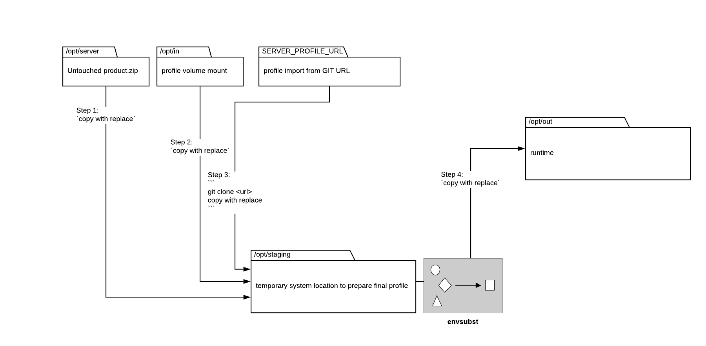

# Anatomy of our product containers

Any configuration that is deployed with one of our product containers can be considered a "server profile". A profile typically looks like a set of files. Profilts can be used in three ways: 1. pulled at startup (most common) 2.  built into the image 3. mounted in to the image. Each of these have their own pros and cons and thus are often used for different purposes [details below](#how-to-provide-a-profile). 

Because you can add profile information to our containers in a variety of ways, it's important to understand the resources and file structure used for our containers.

This is illustrated in two diagrams:

* Resources used at startup.
* How the resources work together.

## Resources used at startup



| Resource | Description |
| --- | --- |
| /opt/server | This directory always contains an untouched, uncompressed copy of the product software version. |
|/opt/in | This directory contains any server profile that you want Docker to mount to the container. |
| SERVER_PROFILE_URL | The URL referencing a Git clone of a server profile from a repository. The profile is cloned to `/tmp/staging` then moved to `/opt/staging`. |
| opt/staging | The directory where the locations and resources mentioned above are moved to and evaluated (variable settings) before being moved to `/opt/out`. |
| envsubst | The configuration data is passed to containers using environment variables. See [Environment substitution](profilesSubstitution.md) for information. |
| opt/out | This directory contains the final, runtime location for all files. This is the directory to persist if you want to save any configuration changes you make in a running product instance. See [Saving your configuration changes](saveConfigs.md) for more information. |

You can open a shell into a Docker container and view the container structure and resources by:

1. Entering `docker container ls` and getting the container ID displayed.

2. Entering `docker exec -it <container-id> /bin/sh`.

## How the resources work together


This is an example of a PingFederate flow illustrating: 

* A common pattern where the PingFederate license is mounted as a file so that it is not stored in a repository. This mount could be a Docker mount, or it could be placed in the Docker image directly using a separate Dockerfile. This is also an acceptable approach for custom extensions and *.jar files.

* GitOps. Any additional profile files relevant to customizing the PingFederate configuration are pulled from a Git repository, for tracking, easy update, and maintenance. 

* In `envsubst`, any remaining configurations needed for PingFederate to run are automatically set using the standard PingFederate environment variables.

See [Customizing server profiles](profiles.md) for more information about customizing deployments with profiles.

## How to Provide a Profile

There are three ways to get configuration into a Ping Identity container. 

1. **Pulled at startup** - Pass a git-based URL and path as environment variables that point to a server profile. If the container sees these variables (SERVER_PROFILE_URL, SERVER_PROFILE_PATH, and optionally SERVER_PROFILE_BRANCH) it clones the repo at startup to pull the profile into the container. There is customizable functionality, but this is the gist of it. 
    - pros: easily sharable, inherently source-controlled. 
    - cons: adds download time at container startup. 
    - usage: This is the most common way that profiles are provided to containers as it makes it very easy to track what is inside and avoids building
    - example: All of our examples on the [getting-started](https://github.com/pingidentity/pingidentity-devops-getting-started) repository :) 

2. **Built into the image** - Build your own image "FROM" a pingidentity image and "COPY" the files in
    - pros: no download at startup, no egress required. 
    - cons: tedious to build images when making iterative changes. 
    - usage: if no access to the github repository, or if heavily spinning containers up and down in production
    - example: if you made a dockerfile at this location: https://github.com/pingidentity/pingidentity-server-profiles/tree/master/baseline it could look similar to: 
    ```
    FROM: pingidentity/pingfederate:2006-10.0.2
    COPY pingfederate/. /opt/in/.
    ```

3. **Mounted Volume** - in docker-compose you can bind-mount a host file system location to a location on the container.
    - pros: most iterative. no download time and can see filesystem while you are working in the container.
    - cons: no great way to do this in kubernetes and other orchestration tools. 
    - usage: when developing a server profile and you want to be able to quickly make changes in the profile and spin up a container against it. 
    - example: if you have a profile in same directory as docker-compose, add a bind-mount volume to /opt/in
    ```
      volumes:
        - ./pingfederate:/opt/in
    ```