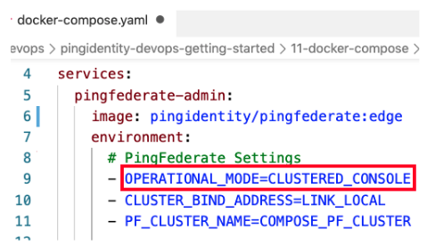

# Environment substitution

In a typical environment, a product configuration is moved from server to server. Hostnames, endpoints, DNS information, and more need a way to be easily modified.

By removing literal values and replacing them with environment variables, configurations can be deployed in multiple environments with minimal change.

All of our configuration files can be parameterized by adding variables using the syntax:
`${filename.ext}.subst`.

## Passing Values to Containers

Within the environment section of your container definition, declare the variable and the value for the product instance.

Values can be defined in many sources, such as inline, env_vars files, and Kubernetes ConfigMaps.

## How it Works

1. A container startup is initiated.

2. The configuration pulls a server profile from Git or from a bind mounted `/opt/in` volume.

3. All files with a `.subst` extension are identified.

4. The environment variables in the identified `.subst` files are replaced with the actual environment values.

5. The `.subst` extension is removed from all the identified files.

6. The product instance for the container is started.

